<!-- Generated by GitHub Profile Agent Console. Edit profile.config.json, then run npm run generate. -->

  <picture>
    <source media="(max-width: 760px) and (prefers-color-scheme: dark)" srcset="./assets/hero/agent-console-b5ee9c4c-mobile-dark.svg">
    <source media="(max-width: 760px)" srcset="./assets/hero/agent-console-b5ee9c4c-mobile-light.svg">
    <source media="(prefers-color-scheme: dark)" srcset="./assets/hero/agent-console-b5ee9c4c-dark.svg">
    <source media="(prefers-color-scheme: light)" srcset="./assets/hero/agent-console-b5ee9c4c-light.svg">
    
  </picture>

  
  

## About Me

Telecommunication Engineering student at PENS who loves exploring cybersecurity, frontend development, and AI-assisted workflows.

I focus on building practical systems—from interactive web applications and CTF security write-ups to IoT-based smart solutions.

## Current Focus

| Area | What I am exploring |
| --- | --- |
| **Frontend & Web Development** | Building modern, responsive web applications and custom systems using Laravel, Livewire, and modern JS frameworks. |
| **Cybersecurity & CTF** | Analyzing vulnerabilities, solving CTF challenges, and writing technical write-ups. |
| **IoT & Smart Systems** | Integrating microcontrollers (ESP32/Arduino) with sensors for real-world automated monitoring solutions. |

## Featured Work

| Project | Focus | Why it matters |
| --- | --- | --- |
| [**Agriconnect**](https://github.com/Humdiess/Agriconnect) | IoT & Smart Agriculture | A smart agriculture system that monitors soil moisture and automates irrigation using ESP32 and sensors. |
| [**PensCert**](https://github.com/Humdiess/PensCert) | Cybersecurity & Document Verification | A platform for securing documents and certificates on PENS. |

## Research Direction

I build and secure modern software systems, combining frontend engineering, IoT microcontrollers, and continuous problem-solving through Capture The Flag (CTF) challenges.

## Tech Stack

`Laravel` · `Livewire` · `TypeScript` · `Next.js` · `Tailwind CSS` · `Python` · `ESP32 / IoT`

## Recent Activity

<!-- AUTO:ACTIVITY:START -->
_No recent public activity was found._
<!-- AUTO:ACTIVITY:END -->

---

  Building thoughtful systems, hacking CTFs, and sharing what works.

