  <picture>
    <source media="(max-width: 760px) and (prefers-color-scheme: dark)" srcset="./docs/assets/demo-mobile-dark.svg">
    <source media="(max-width: 760px)" srcset="./docs/assets/demo-mobile-light.svg">
    <source media="(prefers-color-scheme: dark)" srcset="./docs/assets/demo-dark.svg">
    <source media="(prefers-color-scheme: light)" srcset="./docs/assets/demo-light.svg">
    
  </picture>

<h1 align="center">GitHub Profile Agent Console</h1>

  Turn a transparent portrait and structured profile data into a responsive, animated GitHub Profile README.

  

  
  
  

